# Implementing Generative Adversarial Networks using TensorFlow

Generative Adversarial Networks or GANs is one of the most active area in deep learning research and development owing to quality of generated results. In this blog we will discuss the following things:
- Basic idea and intuition behind workings of Generative Adversarial Networks
- Implementing a GANs based model that generates data from simple distribution
- Visualizing and Analyzing different aspects of GANs

The code for this blog can be found [here](https://github.com/aadilh/blogs/basic-gans/code).

## Generative Adversarial Networks

The basic idea behind GANs is very simple. It includes two agents with competing objectives and thus having a clash of interest. This results in both of them coming up with increasingly complex ways to deceive each other. This kind of situation is modeled in Game Theory as a **minimax** game.

Let us take an example of the process of money counterfeiting. In this process we have basically 2 types agents namely: **criminal** and **cop**. Let us look into their objectives:
- **Criminal's Objective:** The main objective of the criminal is to come up with complex ways of counterfeiting money such that **Cop** cannot distinguish between counterfeited money and real money.
- **Cop's Objective:** The main objective of the cop is to come up with complex ways so as to distinguish between counterfeited money and real money.

As this process progresses **cop** develops more and more sophisticated technology to detect money counterfeiting and **criminal** develops more and more sophisticated technology to counterfeit money. This is what is called an **Adversarial Process**

Generative Adversarial Networks take advantage of Adversarial Process to train two Neural Networks who compete with each other until a desirable equilibrium is reached. In this case we have a **Generator Network G(Z)** which takes input random noise and tries to generate data very close to the dataset we have. Other network is called **Discriminator Network D(X)** which takes input generated data and tries to discrimate between generated data and real data. This network basically does a binary classification and outputs the probability that the input data comes from the real dataset.

In formal sense the objective function of this whole process can be written as:


The usual desirable equilibrium point for the above defined GANs is that the Generator should model the real data and Discriminator should output the probability of 0.5 as the generated data is same as the real data.

You might be wondering why such a complex learning process is even required? What are the advantages of learning such a model? Well the intuition behind this and all the generative approaches follow a famous quote from Richard Feynman:

*`What I cannot create, I do not understand.`*

This is relevant because if we are able to generate real data distribution from a model then it means that we know everything that this to know about that model. A lot of time these real distribution include millions of images and we can generate them using a model that has thousands of parameters then these parameters capture the essence of the given images.

GANs have many other real life short-term applications also which we will discuss in later section.


## Implementing GANs

In this section we will generate a very simple linear data distribution and try to learn a Generator function that generates data from this distribution using GANs model described above.


### Generating Training Data

We implement this by generating random samples using `numpy` library and then generating second coordinate using some kind of function. For the purpose of this demo we have kept the function as a quadratic function for simplicity. You can play with this code to generate dataset with more dimensions and/or more complex relation between its features such as higher degree polynomial, sine, cosine, etc.

```
import numpy as np

def get_y(x):
    return 10 + x*x


def sample_data(n=10000, scale=100):
    data = []

    x = scale*(np.random.random_sample((n,))-0.5)

    for i in range(n):
        yi = get_y(x[i])
        data.append([x[i], yi])

    return np.array(data)

```

The generated data is very simple and can be seen as follows:


### Generator and Discriminator Networks Implementation

In this section we will implement **Generator** and **Discriminator** networks using tensorflow layers.We implement the Generator network using the following function:

```
def generator(Z,hsize=[16, 16],reuse=False):
    with tf.variable_scope("GAN/Generator",reuse=reuse):
        h1 = tf.layers.dense(Z,hsize[0],activation=tf.nn.tanh)
        h2 = tf.layers.dense(h1,hsize[1],activation=tf.nn.tanh)
        out = tf.layers.dense(h2,2)

    return out
```

This function takes in the `placeholder` for random samples (Z), an array `hsize` for the number of units in the 2 hiddden layers and `reuse` variable which is used for reusing the same layers. The output of this function is a 2-dimensional vector which corresponds to the dimensions of the real dataset. The above function can be easily modified to include more number of layers, different types of layers, different activation and different output mapping.


We implement the Discriminator network using the following function:

```
def discriminator(X,hsize=[16, 16],reuse=False):
    with tf.variable_scope("GAN/Discriminator",reuse=reuse):
        h1 = tf.layers.dense(X,hsize[0],activation=tf.nn.tanh)
        h2 = tf.layers.dense(h1,hsize[1],activation=tf.nn.tanh)
        h3 = tf.layers.dense(h2,2)
        out = tf.layers.dense(h3,1)

    return out, h3
```

This function takes input `plcaeholder` for the samples from the vector space of real dataset. The samples can be both real samples and samples generated from Generator network. Similar to the Generator network above it also takes input `hsize` and `reuse`. We use 3 hidden layers for the Discriminator out of which first 2 layers size we take input. We fix the size of the third hidden layer to 2 so that we can visualize the transformed feature space as explained in the later section. The output of this function is `logit` prediction for the given `X` and the output of the last layer which is the feature transformation learned by Discriminator for `X`.

### Adversarial Training

For the purpose of training we define the following placeholders `X` and `Z` for real samples and random noise samples respectively:

```
X = tf.placeholder(tf.float32,[None,2])
Z = tf.placeholder(tf.float32,[None,2])
```

We also need to create the graph for generating samples from Generator network and feeding real and generated samples to the Discriminator network. This is done by using the functions and placeholders defined above:

```
G_sample = generator(Z)
r_logits, r_rep = discriminator(X)
f_logits, g_rep = discriminator(G_sample,reuse=True)
```

Using the logits for generated data and real data we define the loss functions for the Generator and Discriminator networks as follows:

```
disc_loss = tf.reduce_mean(tf.nn.sigmoid_cross_entropy_with_logits(logits=r_logits,labels=tf.ones_like(r_logits)) + tf.nn.sigmoid_cross_entropy_with_logits(logits=f_logits,labels=tf.zeros_like(f_logits)))
gen_loss = tf.reduce_mean(tf.nn.sigmoid_cross_entropy_with_logits(logits=f_logits,labels=tf.ones_like(f_logits)))

```

These losses are simple cross entropy based losses using the equations we defined above.

Now we define the optimizers for the two networks using the loss functions defined above and scope of the layers defined in the `generator` and `discriminator` functions. We use Adam Optimizer for both the networks. Using the scope we fetch the weights/variables for the given network only.

```
gen_vars = tf.get_collection(tf.GraphKeys.GLOBAL_VARIABLES,scope="GAN/Generator")
disc_vars = tf.get_collection(tf.GraphKeys.GLOBAL_VARIABLES,scope="GAN/Discriminator")

gen_step = tf.train.AdamOptimizer().minimize(gen_loss,var_list = gen_vars) # G Train step
disc_step = tf.train.AdamOptimizer().minimize(disc_loss,var_list = disc_vars) # D Train step
```

We then train both the networks in an alternating way for the required number of steps:

```
for i in range(100001):
    X_batch = sample_data(n=batch_size)
    Z_batch = sample_Z(batch_size, 2)
    _, dloss = sess.run([disc_step, disc_loss], feed_dict={X: X_batch, Z: Z_batch})
    _, gloss = sess.run([gen_step, gen_loss], feed_dict={Z: Z_batch})

    print "Iterations: %d\t Discriminator loss: %.4f\t Generator loss: %.4f"%(i,dloss,gloss)
```

The above code can be modified to include more complex training procedures such as running multiple steps of discriminator and/or generator update, fetching the features of the real and generated samples and plotting the generated samples. Please refer to the code repository for such modifications.


## Analyzing GANs

### Visualizing the Training losses

In this section we plot the training losses after every `10` iterations. From the plot we can see that how changes in loss decrease gradually and loss become almost constant towards the end. This negligible change in the loss of both `Discriminator`
and `Generator` indicates equilibrium.


### Visualizing Samples during Training

In this section we plot the real and generated samples after every `1000` iterations of training. These plots visualize how `Generator` network starts with random initial mapping between the input and dataset vector space and then it gradually progresses to resemble the real dataset samples.

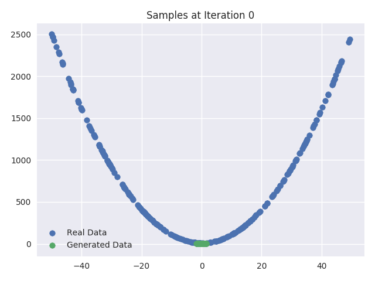
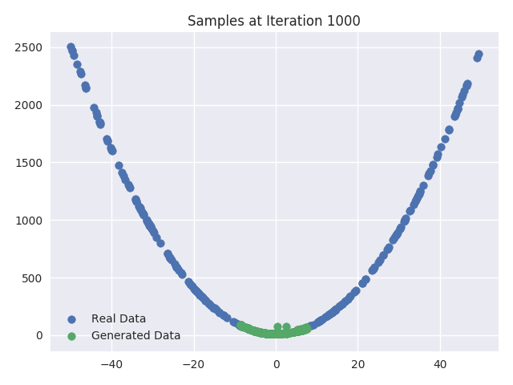
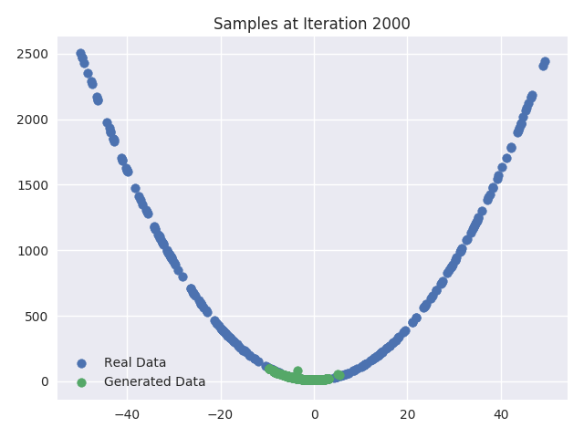

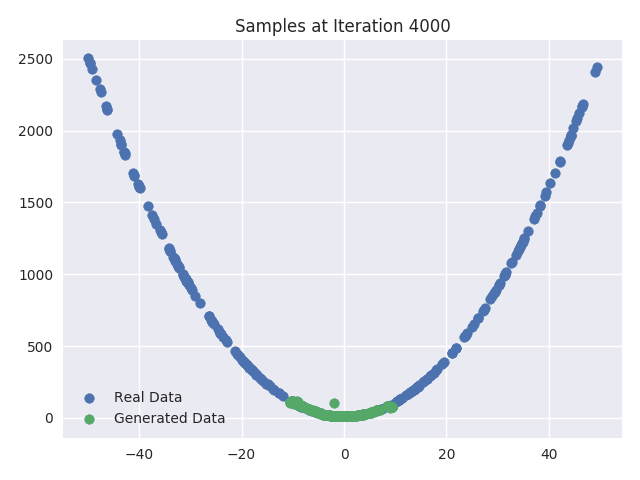


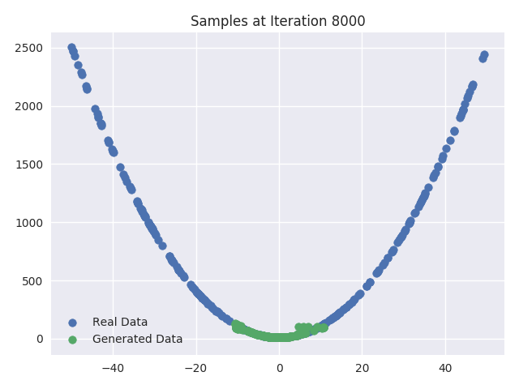


### Visualizing the Generator Update

In this section we plot the feature transform of the real and generated samples as learnt by the `Discriminator` network's last layer before and after we update the weights of the `Generator` network. We also plot the centroids of all the four combinations of data. From the plots we can infer following things:
- As expected there is no change in the transformed features of the real data samples. From the plots we can see they totally coincide.
- From the centroids we can see that centroid of the features of generated data samples almost always moves towards the centroid of the features of real data samples.
- We can also see that as the iterations increase the transformed features of real samples get more and more mixed with transformed features of generated samples. This is also expected because at the end of training `Discriminator` network should not be able of distinguish between real and generated samples. Hence at the end of training transformed features for both the samples should coincide.

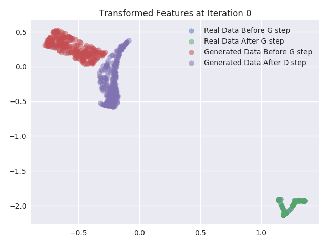 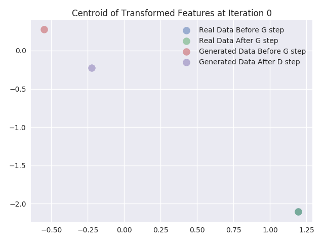
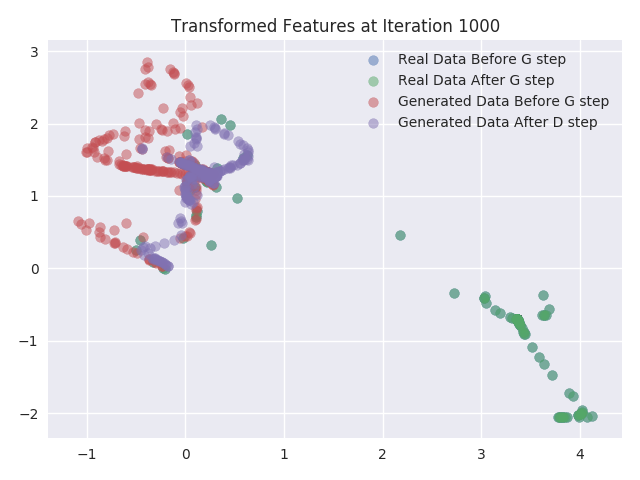 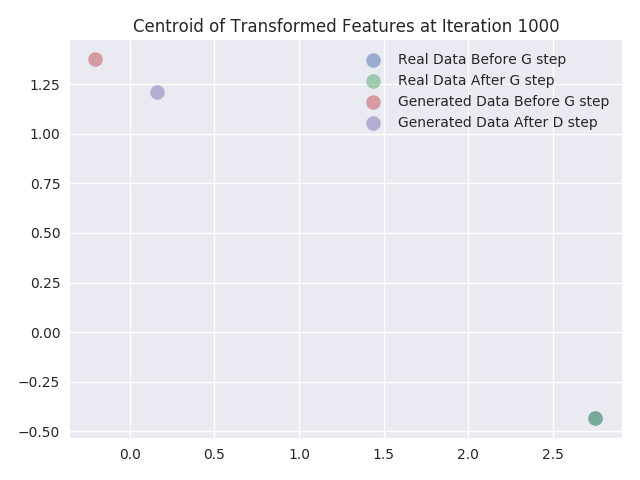
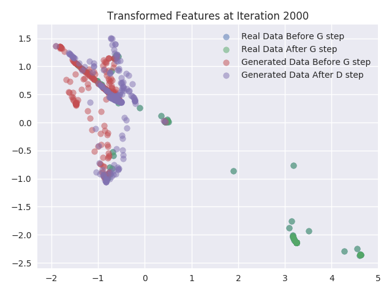 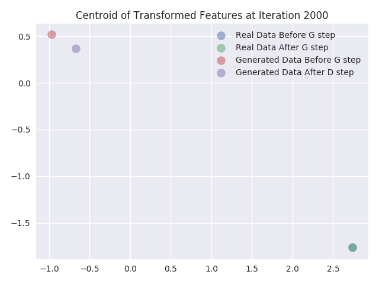
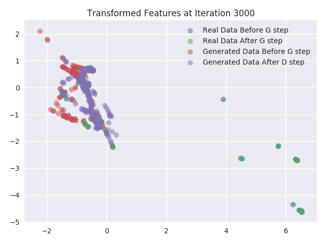 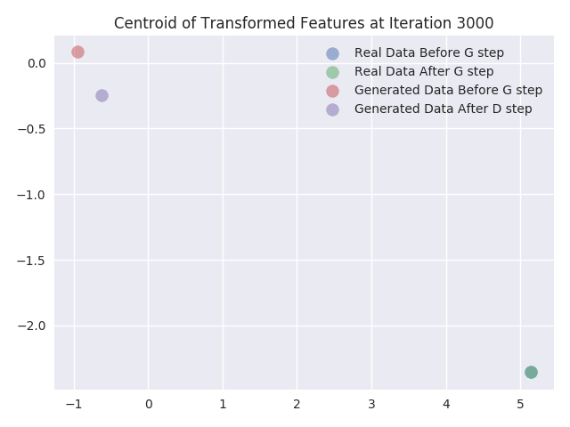
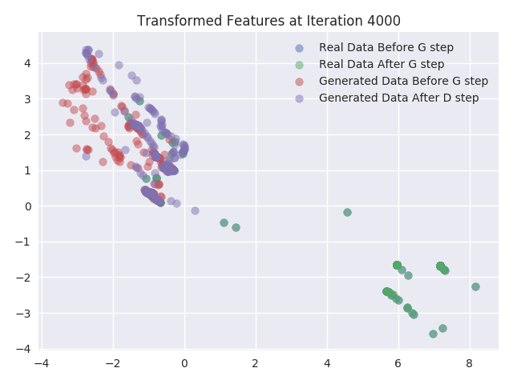 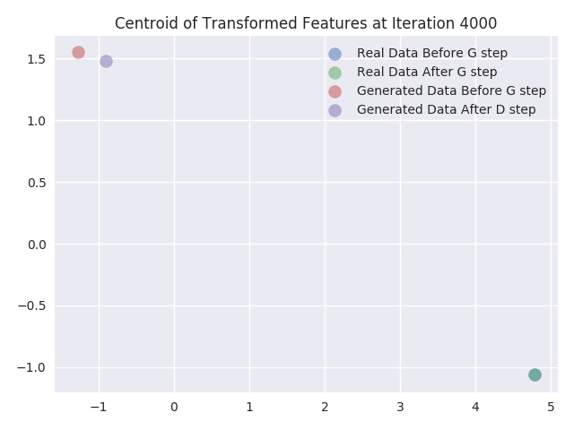
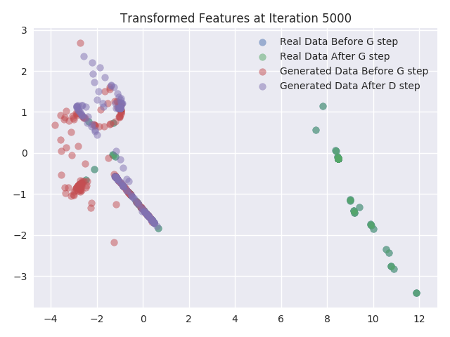 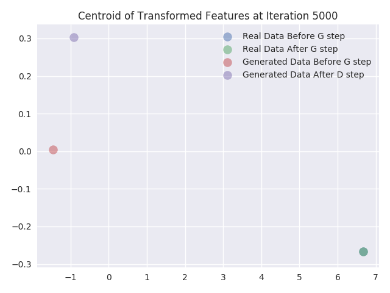
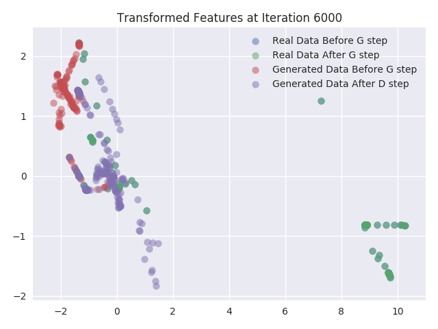 
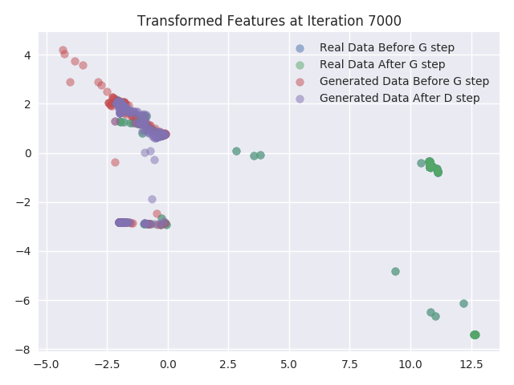 
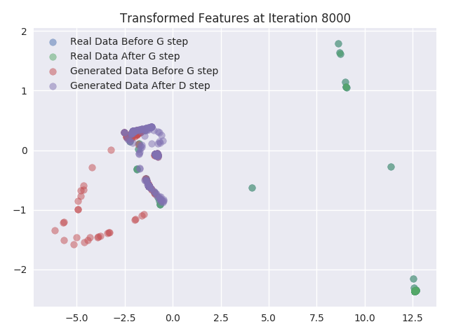 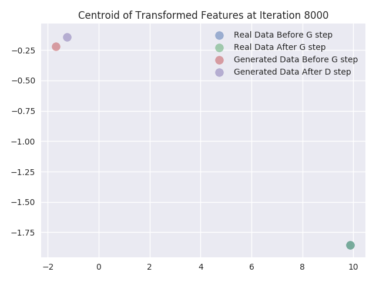
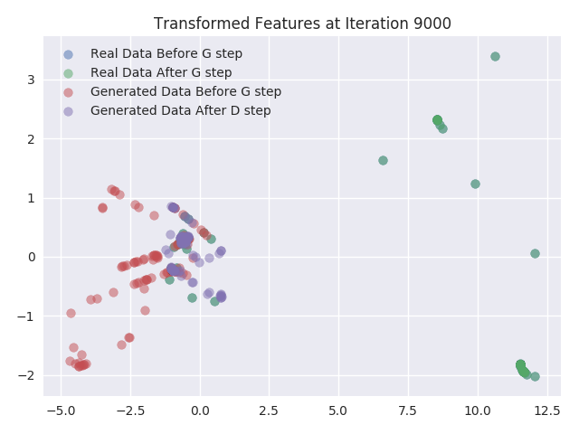 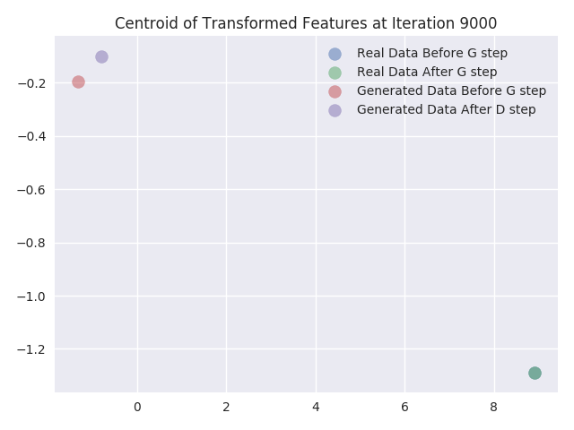
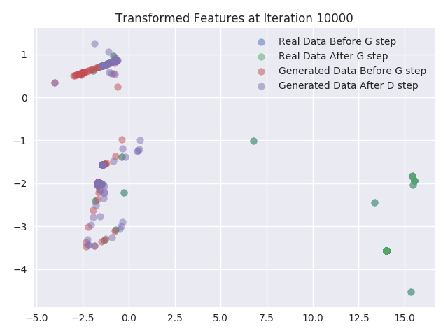 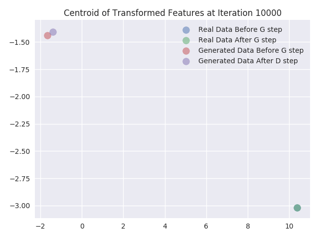

## Discussion and Future Work

In this blog we implemented a GAN model for generating data from a very simple data distribution. We recommend the readers that for more thorough understanding modify the above code to do the following:
- Change the activation functions of the layers and see the difference in training and generated samples.
- Add more layers and different types of layers and see the affect in the training time and the stability of the training.
- Modify the code for generating data to include data from 2 different curves
- Modify the above code to work with more complex data such as MNIST, CIFAR-10, etc.

In future work we will discuss about limitations of the GANs and the modifications that are required to solve them.
